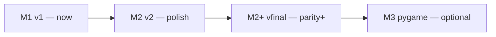

# py_vui roadmap — v1, v2, and “vfinal”

Comparison target: **pyUIBuilder**-class tools (visual layout, property editor, event hooks, export runnable Python UI).  
Phase 2 in [DESIGN_SPEC](./DESIGN_SPEC.md) (pygame studio) is **out of scope** for this document.

## Where we are today (v1 / M1)

| Area | Status | Notes |
|------|--------|--------|
| Project save/load | Done | `py_vui.json` + `session.meta.json`, recent projects |
| Palette + canvas | Done | Drag-drop, select, **move**, **resize (8 handles)** |
| Inspector | Done | Layout, content, appearance, actions |
| Undo/redo | Done | Command stack; drag not coalesced yet |
| Themes + styling | Done | Presets + per-widget overrides; canvas preview |
| Button / field actions | Done | Inline handler editor → `handlers.py` + `interactions.py` |
| Codegen + export | Done | PySide6 bundle, runnable `main.py` |
| Preview | Done | Subprocess launch |
| PyPI / license / docs | Done | MIT, publishing guide |

### v1 gaps vs DESIGN_SPEC MVP

| MVP item | Status |
|----------|--------|
| Resize on canvas | **Done** (this release) |
| Reparent / z-order UI | Partial — model has `ReparentNode`; no tree UI |
| Anchors/margins in editor | Stored only; not visualized |
| Merge regions in codegen | Not yet (`# py_vui: begin custom`) |
| Enabled in export | Done |

**Verdict:** v1 is a **credible early pyUIBuilder alternative** for simple absolute-layout PySide6 apps. It is not yet “daily driver” for complex forms.

---

## v2 — Interactive builder (Phase 1 extended)

Goal: feel **polished and shareable** — something you’d recommend on GitHub/PyPI without caveats.

### Must-have

| Feature | Why |
|---------|-----|
| **Snap + grid** | Align widgets without eyeballing pixels |
| **Alignment tools** | Left/center/right, distribute spacing |
| **Widget tree** | Reparent, reorder z-index, hide/lock |
| **Copy / paste / duplicate** | Real editing speed |
| **More widgets** | `QComboBox`, `QListWidget`, `QTextEdit`, `QGroupBox`, `QTabWidget`, `QRadioButton`, `QSlider`, `QSpinBox` |
| **Tab order** | Accessibility + pyUIBuilder parity |
| **Handler UX** | Pick signal from list; snippet templates; `QMessageBox` import hint in stub |
| **Live preview dock** | Embedded or docked subprocess, not only full regenerate |
| **Autosave + recovery** | `.py_vui.autosave` per project |
| **Codegen merge regions** | Safe hand-edits in `handlers.py` / custom blocks |

### Should-have

| Feature | Why |
|---------|-----|
| Keyboard nudge (arrow keys) | Fine layout |
| Multi-select + group move | Faster layout |
| Constraint hints | Show parent bounds while dragging |
| Export “open in IDE” README | Onboarding |
| Golden screenshot QA | Prevent canvas/codegen regressions |

### Nice-to-have

- Import existing `ui_generated.py` subset (AST)  
- Duplicate project templates (dialog, settings form)  
- Dark chrome for editor matching “Dark” theme  

**Exit criteria:** A new user can build a small settings dialog with tabs, list, and wired buttons in &lt;15 minutes without reading source code.

---

## vfinal — Shareable product (pyUIBuilder-class or better)

Goal: **default recommendation** for “I want a Python GUI without writing layout boilerplate.”

### Differentiators (better than classic pyUIBuilder)

| Pillar | Direction |
|--------|-----------|
| **Modern stack** | PySide6 first, clean async-ready structure, typed project JSON |
| **Git-friendly** | Small JSON diffs, separate `handlers.py` for logic |
| **Themes** | First-class design tokens (already started) |
| **Quality codegen** | Readable files, `WIDGETS` registry, documented extension points |
| **Distribution** | `pip install py-vui[gui]`, optional standalone bundles |

### Parity checklist (pyUIBuilder-like)

| Capability | vfinal target |
|------------|----------------|
| Full common widget set | 15+ Qt widgets |
| Layout managers | Optional pack/grid sections **or** anchor-based resize in codegen |
| Menus / toolbars / dialogs | Templates + codegen |
| All major signals | clicked, toggled, textChanged, currentIndexChanged, … |
| Property coverage | fonts, icons, tooltips, shortcuts |
| Documentation | Tutorials, 3 example projects, 5-min video/GIF |
| Stability | Autosave, crash recovery, no data loss on regen |
| CI + releases | Tagged releases, PyPI, GitHub Actions |

### Explicit non-goals (stay focused)

- Replacing Qt Designer for hand-coded expert UIs  
- Full reactive binding framework  
- Cloud hosting / collaboration (local-first)  
- pygame studio (separate milestone M3/M4 in IMPLEMENTATION_PLAN)

---

## Suggested sequencing

1. **Now → v2:** tree panel, snap/grid, copy/paste, more widgets, autosave, merge regions.  
2. **v2 → vfinal:** menus/dialogs, layout modes, docs, embedded preview, tab order.  
3. **Later:** Phase 2 pygame per IMPLEMENTATION_PLAN (separate product surface).

---

## Quick reference: what to build next

If prioritizing one sprint:

1. Widget tree + reparent  
2. Snap grid (8px) + alignment  
3. `QComboBox` + `QTextEdit` + codegen  
4. Autosave  
5. Copy/paste  

That order maximizes “feels like a real builder” before adding niche features.
